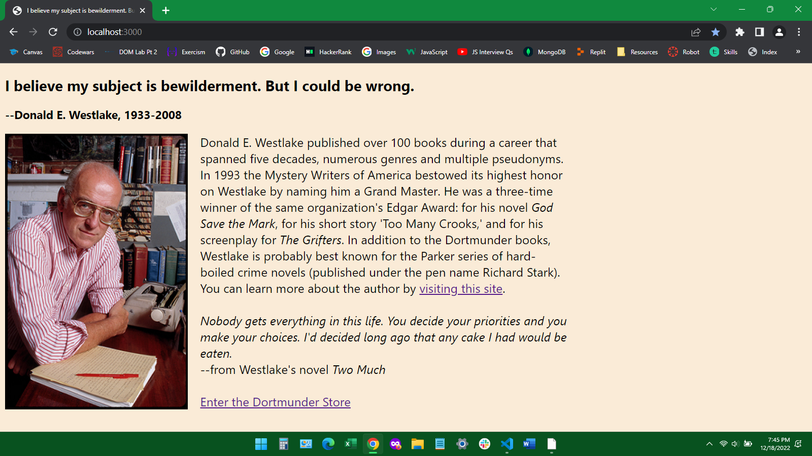
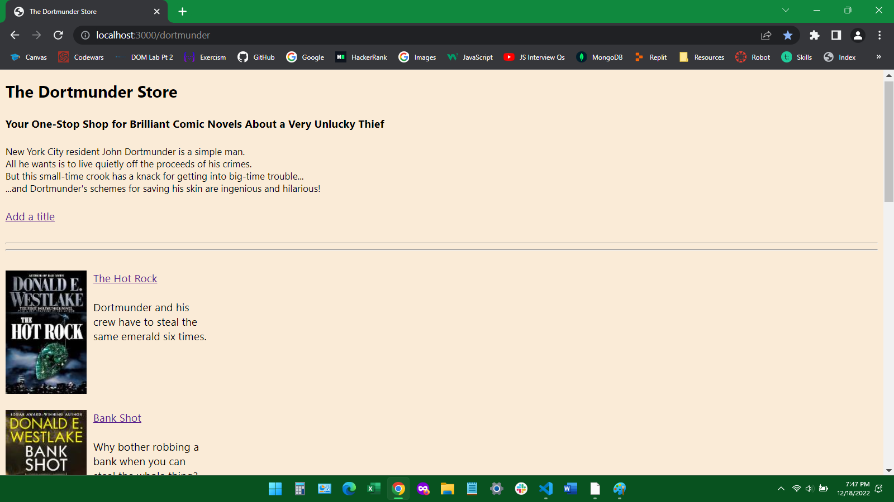
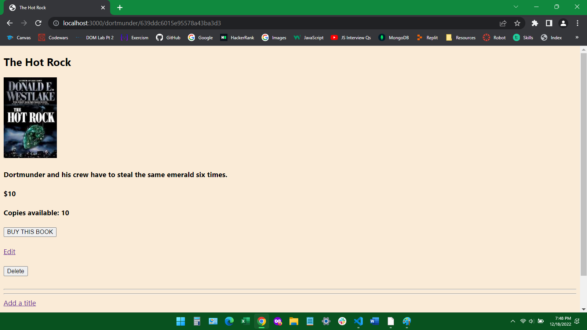

# The Dortmunder Store

## Description
The Dortmunder Store is a virtual bookstore.  Users can browse the collection and click on individual listings for more information.  They can create new listings as well as edit and delete existing ones.  Users can also "buy" books by clicking a button.  No e-commerce was involved in the making of this application.

When a user "buys" a book the inventory of that item is decremented by one unit.  If the inventory reaches 0 the book's listing is updated to show that the book is out of stock, and the Buy button is removed.

This store was created using JavaScript, CSS, HTML, Node, Express, React and MongoDB.  

Below are pictures of the root, index and show pages.

## History
The store was created to meet the requirements of a project assignment in a Per Scholas software engineering boot camp.  Knowing that I had to create a store, I quickly decided that it would be a bookstore, because I like bookstores and this is probably as close as I'll ever get to owning one.  And since I'm always trying to get people to read the Dortmunder novels by Donald E. Westlake, I thought it would be fun to make my bookstore a kind of fan site for that series.

This bookstore project is the culmination of our class's second module, which focused on Express, React and MongoDB.  I built the server.js file using class examples of CRUD applications.  The only difficulty I encountered was getting the Update route to work.  The route was slightly more complicated than the ones I'd created earlier due to the need to decrement the inventory of a given book every time the user clicks a Buy button.  In solving this problem I learned a little bit about JSX conditionals.

The project uses a relatively simple data structure that stores the book's title, a URL for the cover image, the book's price and the number of copies on hand.  A future iteration might include expanded synopses, book excerpts, publication information, sales data, reviews, recommendations and whatever else you can find on that OTHER book-selling website.

The bulk of my time on this project was spent on its look.  Front-end development awakens the long-dormant perfectionist in me.  I don't know if that's a good thing or a bad one.  (It's probably a little of both.)  The look I chose is relatively minimalist but getting it right took a whole lot of trial and error.  It would be a great challenge, I think (great as in difficult but also great as in interesting), to attempt a maximalist look for the Dortmunder Store; to make it look something like what that little operation from Seattle serves up.        

## Miscellaneous
To visit the store, navigate to the URL below.  If you want access to the files you can fork and clone this repository to your machine.  You can also watch a video about the making of this project at [video link, do you need exclamation mark in front of brackets?].

The live site for the store is https://johnvresilovic.github.io/dortmunder

Acknowledgement to powells.com and wikimedia.org for the images used in the project, and to Wikipedia for biographical information about Donald Westlake.  Thanks to my instructors, Tishana Trainor, Kasper Kain and Chase Van Halen, as well as my classmates, in particular Hadia Shafique and Cody Smith, who supplied useful bits of code at critical junctures.

Contact info: johnvresilovic@protonmail.com